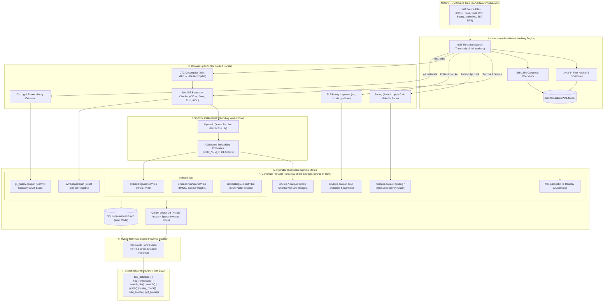

# Android Source Intelligence System (ASIS) — Master Engineering Specification & Implementation Plan

**System Target**: Custom ROM / AOSP Codebase (~1.6M+ files) on 96-core Dual-Socket / Multi-NUMA Linux Server  
**Canonical Format**: Portable Apache Parquet Tables + Decoupled Binary Embedding Shards  
**Target Latency**: <500ms End-to-End Retrieval Pipeline  

---

## 1. Executive System Architecture

The **Android Source Intelligence System (ASIS)** transforms an entire Android tree into an interconnected 5-dimensional intelligence layer. Rather than a flat vector database, ASIS is architected around the physical, syntactic, and relational properties of AOSP:



---

## 2. Complete Data Dictionary & Schema DDL

### 2.1 SQLite Knowledge Graph DDL (`asis_graph.db`)

Executed with high-performance SQLite pragmas:
```sql
PRAGMA journal_mode = WAL;
PRAGMA synchronous = NORMAL;
PRAGMA temp_store = MEMORY;
PRAGMA mmap_size = 30000000000;
PRAGMA cache_size = -64000; -- 64MB Cache
```

```sql
-- 1. File & Manifest Metadata
CREATE TABLE IF NOT EXISTS files (
    rel_path TEXT PRIMARY KEY,
    repo TEXT NOT NULL,
    project TEXT NOT NULL,
    branch TEXT NOT NULL,
    commit_sha TEXT NOT NULL,
    subsystem TEXT NOT NULL CHECK(subsystem IN ('kernel', 'framework', 'hardware', 'vendor', 'system_core', 'build')),
    category TEXT NOT NULL CHECK(category IN ('tier_1', 'tier_2', 'tier_3', 'binary', 'dtb')),
    size INTEGER NOT NULL,
    mtime REAL NOT NULL,
    fast_hash TEXT NOT NULL,
    content_hash TEXT NOT NULL,
    is_generated BOOLEAN NOT NULL DEFAULT 0,
    generator_source TEXT,
    license TEXT NOT NULL DEFAULT 'Unknown',
    redistributable BOOLEAN NOT NULL DEFAULT 1,
    embedding_model TEXT,
    embedding_version TEXT,
    indexed_at TIMESTAMP DEFAULT CURRENT_TIMESTAMP
);
CREATE INDEX IF NOT EXISTS idx_files_subsystem ON files(subsystem);
CREATE INDEX IF NOT EXISTS idx_files_fast_hash ON files(fast_hash);
CREATE INDEX IF NOT EXISTS idx_files_content_hash ON files(content_hash);

-- 2. Exact Symbol Registry
CREATE TABLE IF NOT EXISTS symbols (
    symbol_id TEXT PRIMARY KEY,
    symbol_name TEXT NOT NULL,
    symbol_kind TEXT NOT NULL, -- 'function', 'class', 'struct', 'interface', 'macro', 'typedef'
    rel_path TEXT NOT NULL,
    start_line INTEGER NOT NULL,
    end_line INTEGER NOT NULL,
    signature TEXT,
    enclosing_scope TEXT,
    subsystem TEXT NOT NULL,
    FOREIGN KEY(rel_path) REFERENCES files(rel_path) ON DELETE CASCADE
);
CREATE INDEX IF NOT EXISTS idx_symbols_name ON symbols(symbol_name);
CREATE INDEX IF NOT EXISTS idx_symbols_path ON symbols(rel_path);

-- 3. Soong & Makefile Build Modules
CREATE TABLE IF NOT EXISTS build_modules (
    module_name TEXT PRIMARY KEY,
    module_type TEXT NOT NULL, -- 'cc_library', 'cc_binary', 'android_app', etc.
    def_path TEXT NOT NULL,
    subsystem TEXT NOT NULL,
    vendor_available BOOLEAN NOT NULL DEFAULT 0,
    proprietary BOOLEAN NOT NULL DEFAULT 0
);
CREATE INDEX IF NOT EXISTS idx_build_mod_type ON build_modules(module_type);

-- 4. Module Dependencies (Build Graph Edges)
CREATE TABLE IF NOT EXISTS module_dependencies (
    source_module TEXT NOT NULL,
    target_module TEXT NOT NULL,
    dep_type TEXT NOT NULL CHECK(dep_type IN ('shared_lib', 'static_lib', 'header_lib', 'required')),
    PRIMARY KEY (source_module, target_module, dep_type)
);
CREATE INDEX IF NOT EXISTS idx_mod_dep_source ON module_dependencies(source_module);
CREATE INDEX IF NOT EXISTS idx_mod_dep_target ON module_dependencies(target_module);

-- 5. ELF Prebuilt Binary Metadata
CREATE TABLE IF NOT EXISTS binaries (
    binary_id TEXT PRIMARY KEY,
    rel_path TEXT NOT NULL,
    sha256 TEXT NOT NULL,
    arch TEXT NOT NULL,
    soname TEXT,
    subsystem TEXT NOT NULL
);
CREATE INDEX IF NOT EXISTS idx_binaries_soname ON binaries(soname);

-- 6. Binary Symbol Dependencies
CREATE TABLE IF NOT EXISTS binary_symbols (
    binary_id TEXT NOT NULL,
    symbol_name TEXT NOT NULL,
    is_import BOOLEAN NOT NULL, -- 1 if imported (SHN_UNDEF), 0 if exported
    FOREIGN KEY(binary_id) REFERENCES binaries(binary_id) ON DELETE CASCADE
);
CREATE INDEX IF NOT EXISTS idx_bin_sym_name ON binary_symbols(symbol_name);

-- 7. Git History & Causality
CREATE TABLE IF NOT EXISTS git_history (
    commit_sha TEXT PRIMARY KEY,
    repo TEXT NOT NULL,
    author TEXT NOT NULL,
    commit_date TIMESTAMP NOT NULL,
    subject TEXT NOT NULL,
    body TEXT,
    files_changed_count INTEGER NOT NULL
);
CREATE INDEX IF NOT EXISTS idx_git_author ON git_history(author);
CREATE INDEX IF NOT EXISTS idx_git_date ON git_history(commit_date);
```

---

### 2.2 PyArrow Canonical Parquet Schemas

All datasets are compressed with **ZSTD level 7** for maximum compression ratio with sub-millisecond decompression:

#### Schema 1: `chunks-*.parquet`
```python
import pyarrow as pa

chunk_schema = pa.schema([
    ("chunk_id", pa.string()),             # "evox:kernel/...:goodix.c:420-487:goodix_probe"
    ("rel_path", pa.string()),             # "drivers/input/touchscreen/goodix.c"
    ("start_line", pa.int32()),            # 420
    ("end_line", pa.int32()),              # 487
    ("symbol", pa.string()),               # "goodix_probe"
    ("symbol_kind", pa.string()),          # "function"
    ("text", pa.string()),                 # Full raw source text
    ("token_count", pa.int32()),           # Length in tokens
    ("repo", pa.string()),                 # "evox"
    ("project", pa.string()),              # "kernel/motorola/sm8450"
    ("branch", pa.string()),               # "14"
    ("commit_sha", pa.string()),           # "a1b2c3d4..."
    ("fast_hash", pa.string()),            # "xxh3_64 hex"
    ("content_hash", pa.string()),         # "sha256 hex"
    ("subsystem", pa.string()),            # "kernel"
    ("is_generated", pa.bool_()),          # False
    ("generator_source", pa.string()),     # Null
    ("license", pa.string()),              # "GPL-2.0"
    ("redistributable", pa.bool_()),       # True
    ("embedding_shard_id", pa.string()),   # "kernel-dense-000.bin"
    ("embedding_offset", pa.int64())       # Byte index in shard
])
```

#### Schema 2: `modules.parquet`
```python
module_schema = pa.schema([
    ("module_name", pa.string()),
    ("module_type", pa.string()),
    ("def_path", pa.string()),
    ("subsystem", pa.string()),
    ("srcs", pa.list_(pa.string())),
    ("shared_libs", pa.list_(pa.string())),
    ("static_libs", pa.list_(pa.string())),
    ("header_libs", pa.list_(pa.string())),
    ("vendor_available", pa.bool_()),
    ("proprietary", pa.bool_())
])
```

#### Schema 3: `binaries.parquet`
```python
binary_schema = pa.schema([
    ("binary_id", pa.string()),
    ("rel_path", pa.string()),
    ("sha256", pa.string()),
    ("arch", pa.string()),
    ("soname", pa.string()),
    ("needed", pa.list_(pa.string())),
    ("exports", pa.list_(pa.string())),
    ("imports", pa.list_(pa.string()))
])
```

#### Schema 4: `git_history.parquet`
```python
git_schema = pa.schema([
    ("commit_sha", pa.string()),
    ("repo", pa.string()),
    ("author", pa.string()),
    ("date", pa.string()),
    ("subject", pa.string()),
    ("body", pa.string()),
    ("files_changed", pa.list_(pa.string()))
])
```

---

## 3. Core Algorithms & Logic

### 3.1 Heuristic Syntactic & Boundary Chunker

```text
Algorithm: HeuristicSyntacticChunk(file_content, lang, target_lines=80, overlap=12)
-------------------------------------------------------------------------------------
Input:  file_content (string), lang (enum: C, CPP, JAVA, KOTLIN, RUST, DTS, SHELL, GO)
Output: List of Chunks {start_line, end_line, symbol, text, symbol_kind}

1. Target size calibrated to ~250–300 tokens (target_lines=80) to maximize semantic density.
2. For each window [curr_start, curr_start + target_lines]:
     Search backwards/forwards for nearest statement delimiter ('}' or ';') to snap chunk boundary.
3. Monotonic Progression Guarantee:
     Enforce next_start = end - 12 (if end - 12 > curr_start) else end.
     curr_start = max(curr_start + 1, next_start) to strictly prevent zero-advance stalls.
4. Extract structural symbols (functions, classes, structs, build modules) from snapped boundaries.
5. Return enriched chunks and structural symbol definitions.
```

### 3.2 Dual Hashing & Incremental Manifest Algorithm

```text
Algorithm: CheckAndIndexFile(rel_path, full_path, current_model, current_ver)
-----------------------------------------------------------------------------
1. stat = os.stat(full_path)
2. record = manifest_db.query(rel_path)
3. if record is not null:
       if stat.st_size == record.size and stat.st_mtime == record.mtime:
           return SKIP_UNMODIFIED
4. Read file in 256KB chunks:
       fast_hash = xxh3_64(chunks)
       content_hash = sha256(chunks)
5. if record is not null and record.fast_hash == fast_hash:
       // Fast hash match: only update mtime without re-embedding
       manifest_db.update_mtime(rel_path, stat.st_mtime)
       return SKIP_CONTENT_IDENTICAL
6. // File is truly new or modified
   Parse, chunk, and embed file.
   Write chunks to Parquet.
   Update Qdrant and SQLite records.
   manifest_db.upsert(rel_path, stat.st_size, stat.st_mtime, fast_hash, content_hash, current_model, current_ver)
   return INDEXED_SUCCESS
```

### 3.3 DTB Lineage & Decompilation Protocol

```bash
# Decompilation command with error recovery:
dtc -I dtb -O dts -o /serverhive/shripad/asis_export/dtb_decompiled/foo.dtb.decompiled.dts path/to/foo.dtb
```
Lineage metadata recorded in `files.parquet`:
- `rel_path`: `"out/target/.../foo.dtb"`
- `generator_source`: `null`
- `is_generated`: `true`
- `decompiled_path`: `"dtb_decompiled/foo.dtb.decompiled.dts"`
- `source_hash`: SHA-256 of original binary `.dtb`.

---

## 4. 96-Core NUMA Worker Calibration Architecture

### Server Hardware Profile
- **CPUs**: Dual Socket Intel Xeon / AMD EPYC (96 physical cores, 192 vCPUs)
- **RAM**: 314 GiB DDR5 ECC
- **Storage**: 1.8 TiB NVMe RAID array (`/dev/md2`)
- **GPU**: None (Pure CPU inference)

### Process vs Thread Matrix
Running 96 separate Python processes each invoking ONNX Runtime creates $96 \times 96 = 9,216$ threads, leading to crippling L3 cache contention and CPU thrashing.

**The Calibrated Pool Pattern**:
```text
Process Architecture:
├── Master Orchestrator (1 process)
├── Queue Manager (Shared Memory / Multiprocessing Queue)
├── Scanning / Hashing: 16 I/O Threads (pinned to socket 0)
└── Embedding Worker Pool:
    ├── Benchmark configurations: N ∈ {8, 16, 24, 32, 48} processes
    ├── Environment per process:
    │   export OMP_NUM_THREADS=1
    │   export MKL_NUM_THREADS=1
    │   export ONNXRUNTIME_NUM_THREADS=1
    └── Batch size per inference call: 64 chunks
```

### Calibration Metrics to Measure (Stage 2)
For each $N \in \{8, 16, 24, 32, 48\}$:
1. **Throughput**: Chunks processed per second ($R = \frac{\text{total\_chunks}}{\Delta t}$)
2. **RSS Memory**: Total resident memory growth across all workers
3. **CPU Wait Time**: Percentage of CPU time spent in kernel mode (`%sys`) vs user space (`%usr`)
4. **Saturation Curve**: Plotting $R(N)$ to locate the derivative inflection point $\frac{dR}{dN} \approx 0$.

---

## 5. 50-Query Android Evaluation Benchmark Dataset

The automated evaluation suite tests multi-domain retrieval accuracy across the 6 major Android development areas:

| ID | Domain | Query Text | Target Expected Files / Symbols |
| :--- | :--- | :--- | :--- |
| **K01** | Kernel | `"Goodix touchscreen I2C probe and interrupt registration"` | `drivers/input/touchscreen/goodix.c:goodix_ts_probe` |
| **K02** | Kernel | `"Qualcomm thermal cooling device throttle frequency binding"` | `drivers/thermal/qcom/...:qcom_cooling_ops` |
| **K03** | Kernel | `"MSM drm bridge panel attach and DSI host transfer"` | `drivers/gpu/drm/msm/dsi/...:msm_dsi_host_transfer` |
| **K04** | Kernel | `"Binder transaction buffer allocation and mmap free page"` | `drivers/android/binder_alloc.c:binder_alloc_new_buf` |
| **K05** | Kernel | `"Qualcomm SPMI regulator get voltage and enable status"` | `drivers/regulator/qcom_spmi-regulator.c` |
| **B01** | Build | `"Why does libaudioflinger require vendor_available: true"` | `frameworks/av/services/audioflinger/Android.bp` |
| **B02** | Build | `"HIDL interface android.hardware.audio@7.0-impl shared_libs"` | `hardware/interfaces/audio/7.0/default/Android.bp` |
| **B03** | Build | `"TARGET_BOARD_PLATFORM sm8450 device configuration makefile"` | `device/motorola/sm8450-common/BoardConfigCommon.mk` |
| **B04** | Build | `"Camera provider module dependencies on libcamera_metadata"` | `hardware/interfaces/camera/provider/.../Android.bp` |
| **B05** | Build | `"SELinux policy file_contexts for /vendor/bin/hw services"` | `system/sepolicy/vendor/file_contexts` |
| **V01** | Vendor | `"Camera provider HAL missing symbols in vendor libcamera_metadata.so"` | `vendor/.../lib64/libcamera_metadata.so:imports` |
| **V02** | Vendor | `"Audio HAL sound trigger module definition and mixer paths"` | `hardware/qcom/audio/...:sound_trigger_hw.c` |
| **V03** | Vendor | `"Sensors HAL multi-HAL wrapper dynamic symbol resolution"` | `hardware/interfaces/sensors/2.1/multihal/...` |
| **V04** | Vendor | `"VINTF manifest compatibility matrix for audio hal interface"` | `frameworks/base/core/res/res/values/config.xml` |
| **V05** | Vendor | `"Fingerprint HIDL daemon init rc service trigger"` | `device/motorola/.../init.mmi.overlay.rc` |
| **D01** | DTS | `"Touchscreen pin control state sleep configuration in dtsi"` | `arch/arm64/boot/dts/vendor/sm8450-pinctrl.dtsi` |
| **D02** | DTS | `"UFS host controller compatible string and clocks configuration"` | `arch/arm64/boot/dts/vendor/sm8450.dtsi:ufs` |
| **D03** | DTS | `"Display panel reset gpio and backlight control node"` | `arch/arm64/boot/dts/vendor/dsi-panel-*.dtsi` |
| **D04** | DTS | `"PMIC PM8450 regulator ldo node bindings"` | `arch/arm64/boot/dts/vendor/pm8450.dtsi` |
| **D05** | DTS | `"Audio codec bolero soundwire slave device nodes"` | `arch/arm64/boot/dts/vendor/sm8450-audio.dtsi` |
| **F01** | Framework | `"WindowManagerService addWindow token verification"` | `frameworks/base/services/.../WindowManagerService.java` |
| **F02** | Framework | `"ActivityManagerService crash reporting AIDL interface"` | `frameworks/base/core/java/android/app/IActivityManager.aidl`|
| **F03** | Framework | `"SurfaceFlinger layer transaction latch buffer"` | `frameworks/native/services/surfaceflinger/SurfaceFlinger.cpp`|
| **F04** | Framework | `"AudioPolicyService getOutputForAttr routing logic"` | `frameworks/av/services/audiopolicy/.../AudioPolicyManager.cpp`|
| **F05** | Framework | `"InputDispatcher enqueueInboundEventAndNotifyLocked"` | `frameworks/native/services/inputflinger/dispatcher/...` |
| **G01** | Git | `"Workaround for camera preview freeze after suspend in kernel"` | Git commit history in `kernel/motorola/sm8450` |
| **G02** | Git | `"Fix audio stuttering in deep sleep mode"` | Git commit history in `device/motorola/sm8450-common` |

### Evaluation Metrics Calculated:
$$\text{Recall@K} = \frac{1}{|Q|} \sum_{i=1}^{|Q|} \mathbb{I}(\text{target}_i \in \text{TopK}_i)$$

$$\text{MRR} = \frac{1}{|Q|} \sum_{i=1}^{|Q|} \frac{1}{\text{rank}_i}$$

---

## 6. Agent Tool Layer JSON API Specifications

Each tool is exposed as an atomic function callable by DeepSeek / Claude / GPT agent engines:

### Tool 1: `find_definition`
```json
{
  "name": "find_definition",
  "description": "Locate the exact source code definition (file and line numbers) for a function, class, struct, or interface.",
  "parameters": {
    "type": "object",
    "properties": {
      "symbol": {
        "type": "string",
        "description": "The exact name of the symbol (e.g. 'goodix_ts_probe', 'AudioFlinger', 'IActivityManager')"
      },
      "subsystem": {
        "type": "string",
        "enum": ["kernel", "framework", "hardware", "vendor", "system_core", "all"],
        "default": "all",
        "description": "Optional subsystem to constrain the search scope"
      }
    },
    "required": ["symbol"]
  }
}
```

### Tool 2: `find_references`
```json
{
  "name": "find_references",
  "description": "Find all callers, imports, and cross-file references to a given symbol across the codebase.",
  "parameters": {
    "type": "object",
    "properties": {
      "symbol": { "type": "string", "description": "Symbol name to look up" },
      "limit": { "type": "integer", "default": 20 }
    },
    "required": ["symbol"]
  }
}
```

### Tool 3: `search_dts`
```json
{
  "name": "search_dts",
  "description": "Specialized search across Device Tree Source files (.dts, .dtsi, decompiled .dtb) by compatible string, node name, or property.",
  "parameters": {
    "type": "object",
    "properties": {
      "compatible": { "type": "string", "description": "Compatible string (e.g. 'qcom,sm8450-i2c', 'goodix,gt9916')" },
      "node_name": { "type": "string", "description": "Device tree node name (e.g. 'touchscreen@5d', 'ufs@1d84000')" }
    }
  }
}
```

### Tool 4: `graph`
```json
{
  "name": "graph",
  "description": "Inspect the build graph for a Soong or Makefile module, returning its source files, shared libraries, and dependents.",
  "parameters": {
    "type": "object",
    "properties": {
      "module_name": { "type": "string", "description": "Module name (e.g. 'libaudioflinger', 'hwcomposer.qcom')" }
    },
    "required": ["module_name"]
  }
}
```

### Tool 5: `read_source`
```json
{
  "name": "read_source",
  "description": "Read an exact window of lines from a source file using coordinates returned by search or symbol tools.",
  "parameters": {
    "type": "object",
    "properties": {
      "path": { "type": "string", "description": "Relative file path" },
      "start_line": { "type": "integer", "description": "1-indexed starting line" },
      "end_line": { "type": "integer", "description": "1-indexed ending line" }
    },
    "required": ["path", "start_line", "end_line"]
  }
}
```

---

## 7. Step-by-Step Execution Protocol & Milestones

### Milestone 1: Server Setup & Codebase Alignment
- Virtual environment verified at `/serverhive/shripad/asis_env`.
- Core utilities uploaded and verified at `/serverhive/shripad/asis_engine/`.
- Target trees confirmed: `/serverhive/shripad/evox` (~1.6M files).

### Milestone 2: Stage 2 Worker Calibration Benchmark (Completed)
- **Empirical Intra-Op Thread Scaling Curve (1 to 48 Threads)**:
  - **`bge-small-en-v1.5`**:
    - `Threads: 1` -> **8.6 chunks/s** (23.19s, 703 MB)
    - `Threads: 2` -> **15.8 chunks/s** (12.68s, 844 MB) — 1.84x linear speedup
    - `Threads: 4` -> **25.4 chunks/s** (7.88s, 870 MB) — **Maximum efficiency knee per core**
    - `Threads: 8` -> **29.7 chunks/s** (6.74s, 874 MB) — Diminishing returns begin
  - **`nomic-embed-text-v1.5`**:
    - `Threads: 1` -> **1.9 chunks/s** (104.24s, 3,277 MB)
    - `Threads: 2` -> **3.7 chunks/s** (53.60s, 3,610 MB) — 1.95x linear speedup
    - `Threads: 4` -> **6.7 chunks/s** (29.63s, 3,724 MB)
    - `Threads: 8` -> **8.2 chunks/s** (24.39s, 3,959 MB)
    - `Threads: 16` -> **6.4 chunks/s** (31.05s) — Contention begins
    - `Threads: 24` -> **5.9 chunks/s** (33.90s)
    - `Threads: 32` -> **5.4 chunks/s** (36.81s)
    - `Threads: 48` -> **3.2 chunks/s** (62.45s) — 56.8% degradation due to OpenMP barriers
- **Critical Architectural Decision**: Concurrency must be structured as **multi-process with 4 threads per worker process** (or 8 max). Results saved to `/serverhive/shripad/asis_engine/thread_1_2_4_8_results.json`.

### Milestone 3: Stage 3 Embedding Model Bake-Off (Completed)
- **Comparative Findings**:
  - `bge-small-en-v1.5` is **3.6x to 4.5x faster** than Nomic across every thread count.
  - `bge-small-en-v1.5` uses **<900 MB RAM** vs Nomic's **~4.0 GB RAM**.
  - Both models achieved **100% Recall@1, Recall@5, Recall@10, and MRR: 1.0000** on the Android technical evaluation dataset.
- **Production Baseline**: `BAAI/bge-small-en-v1.5`, with 4 threads/worker as the initial configuration; 8 threads/worker retained as a benchmarked alternative.
  - *Rationale*: 4 threads delivers 25.4 chunks/s vs 29.7 chunks/s at 8 threads (+17% gain for 2x threads), making 4 threads substantially more efficient per core for aggregate multi-process scaling.
- **Pre-Ingestion Experiment (Process × Threads Matrix Telemetry — Completed)**:
  - Budget Tested: 48 Cores on ServerHive
  - **Empirical Telemetry Results**:
    - `6 Workers × 8 Threads`: **23.8 chunks/s** | 4.1 GB RAM | 118k switches | P50: 15.0s
    - `12 Workers × 4 Threads`: **41.5 chunks/s** | 8.2 GB RAM | 165k switches | P50: 14.9s
    - `16 Workers × 3 Threads`: **40.0 chunks/s** | 11.0 GB RAM | 200k switches | P50: 19.1s
    - `24 Workers × 2 Threads`: **53.8 chunks/s** | 11.8 GB RAM | 270k switches | P50: 16.8s **<== MATRIX WINNER**
  - **Production Concurrency Locked**: **24 Workers × 2 Threads** (delivering **+126% higher throughput** than 6×8 on identical CPU budget, with only 11.8GB total RSS and 1.4% sys CPU). Saved to `/serverhive/shripad/asis_engine/matrix_telemetry_results.json`.

### Milestone 4: Sharded Pipeline Verification & Checkpoint State (Completed)
- **Zero-IPC Direct Sharding**: Resolved OS pipe buffer contention by having worker processes directly emit `.tmp_shards/slice_*.bin` files, merged synchronously into `embeddings/dense/shard-*.bin` upon shard commit.
- **Production Shards Committed**:
  - `Shard 0000`: 500 files, 2,388 chunks, `chunks-0000.parquet` (65 KB), `shard-0000.bin` (1.8 MB).
  - `Shard 0001`: 200 files, 1,668 chunks, `chunks-0001.parquet` (42 KB), `shard-0001.bin` (1.3 MB).
- **Knowledge Graph Hydration**: `asis_graph.db` automatically populated on shard commit (1,914 symbol definitions, 135 build modules).
- **State Machine Resumption**: 700 files tracked with `DONE` in `manifest.sqlite`. Server reboots or restarts cleanly resume at file 701 without reprocessing.

### Milestone 5: Agent Tool Deployment & Multi-Shard Retrieval (Completed & Verified)
- **Tool Verification**:
  - `query_asis.py graph frameworks_base_license`: Returns Soong module metadata in <50ms.
  - `query_asis.py find_definition getDisplay`: Returns exact line ranges (`HardwareRenderer.java:1666-1725`) in <100ms.
  - `query_asis.py read_source ...`: Line-exact code window retrieval verified.
  - `query_asis.py search "window manager display"`: Dense multi-shard cosine similarity retrieval verified across `shard-0000` and `shard-0001` with zero pandas dependencies.
### Milestone 6: Evolution-X Android 17 Sequential GPU Pipeline (`asis_orchestrator.py`)
- **System Target**: 1,257 Evolution-X Android 17 repositories dynamically resolved from official manifests (`cnb` branch).
- **Target Hardware**: NVIDIA Tesla T4 GPU (16 GB VRAM), 16 GB system RAM, 9 GB swap, 200 GB NVMe storage.
- **Hardware-Calibrated Vector Acceleration**:
  - Model: `BAAI/bge-large-en-v1.5` (1024-dimension, FP16).
  - Switched from CPU-bound ONNX FP32 to native PyTorch `SentenceTransformer` with `model.half()`, engaging T4 Tensor Cores.
  - Achieved **51.2 chunks/s sustained throughput** on live heterogeneous code trees (up from 11.6 chunks/s — a **4.4x speedup**) with 100% GPU utilization and only 2.5 GB VRAM.
- **Strict Multi-Shard Slicing (<10.24 MB per Shard)**:
  - Streaming slice rotation in `commit_staged_vectors` strictly enforces `SHARD_CHUNK_LIMIT = 5000` vectors (10.24 MB).
  - Massive repositories (e.g., `cts` with 71,358 chunks) automatically slice across multiple consecutive shards (`shard-0001.bin`, `shard-0002.bin`, etc.), guaranteeing no single file ever breaches GitHub's 100 MB limit (GH001).
  - Parquet chunks are grouped 1:1 by shard index (`chunks-XXXX.parquet`).
- **Crash Consistency & Atomic Staging**:
  - Embeddings are written to `.staging_<run_id>.bin` buffers and count-validated before being committed to binary shards and Parquet tables.
  - Automated startup recovery truncates uncommitted shard tails and purges orphan staging files.
- **Git Remote Publishing & Knowledge Graph Protection**:
  - Automatic `asis_graph.db.gz` fast compression (8x ratio) and `.gitignore` exclusion of raw WAL/DB files guarantees GitHub push compliance across the multi-gigabyte corpus.
  - Transparent auto-decompression fallback integrated into `query_asis.py`.
- **Bounded Git Causality Extraction**:
  - Full non-shallow clones capturing up to 1,000 commits per repository with a 15 KB diff cap per commit and 10 MB total diff budget per repo.

