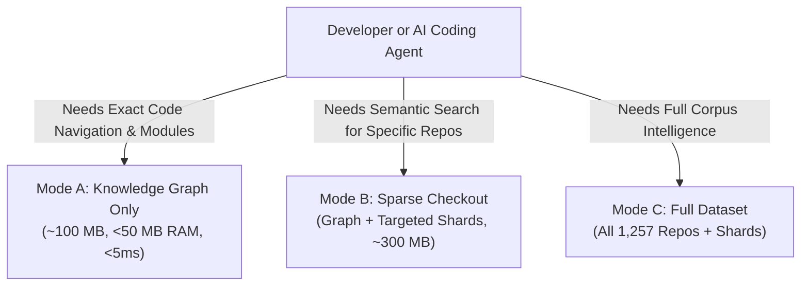

# ASIS: Android Source Intelligence System — Data Distribution (`asis-data`)

**Corpus Target**: Evolution-X Android 17 (1,257 Repositories, AOSP + LineageOS + Evolution-X)  
**Embeddings**: Dense 1024-dim FP16 (`BAAI/bge-large-en-v1.5`)  
**Storage**: Bounded Binary Vector Shards (<= 10.24 MB), Apache Parquet Tables (ZSTD), SQLite Knowledge Graph (WAL mode)  
**Remote Compliance**: Zero files > 100.00 MB (Full GitHub remote compliance via multipart graph slicing)

---

## 1. Dataset Contents & Structure

```
asis-data-export/
├── .gitignore                       (Excludes raw WAL/DB and monolithic gz)
├── README.md                        (This guide)
├── manifest.sqlite                  (Repository status, run IDs, shard tracking)
├── asis_graph.db.gz.part00          (Part 1 of compressed SQLite knowledge graph, <= 45 MB)
├── asis_graph.db.gz.part01          (Part 2 of compressed SQLite knowledge graph, <= 45 MB)
├── asis_graph.db.gz.part02          (Part 3 of compressed SQLite knowledge graph, <= 45 MB)
├── chunks-0000.parquet              (Code chunks with line ranges & tokens)
├── files-0000.parquet               (File registry, subsystems, hashes)
├── git_history-0000.parquet         (Commit history, causality & diff patches)
└── embeddings/
    └── dense/
        ├── shard-0000.bin           (5,000 vectors * 2,048 bytes = 10.24 MB FP16)
        └── shard-0001.bin           (...)
```

---

## 2. Developer & AI Agent Quickstart: Running & Querying ASIS

ASIS is designed to run efficiently on any machine, from a **$5/month 1 vCPU / 2 GB RAM** instance to a multi-GPU workstation. You do not need to download the full multi-gigabyte corpus if you only need code intelligence.

Choose the deployment mode that fits your workload:



---

### Mode A: Knowledge Graph Only (Ultra-Lightweight / Best for 1 vCPU, 2 GB RAM)

**Ideal for**: AI agents needing exact symbol lookups, function/class signatures, Soong build targets, file ranges, and commit causality in sub-5 milliseconds.

1. **Clone only the metadata and graph** (no vector shards):
   ```bash
   git clone --filter=blob:none --no-checkout https://github.com/shripad-jyothinath/asis-engine-plan.git asis-data-export
   cd asis-data-export
   git checkout origin/asis-data -- "asis_graph.db.gz.part*" manifest.sqlite
   ```

2. **Querying via `query_asis.py`**:
   The engine automatically detects and stitches `asis_graph.db.gz.part*` into `asis_graph.db` on first run.

   ```bash
   # Exact symbol definition lookup (< 5ms)
   python query_asis.py find_definition getDisplay

   # Filter symbol lookup by Android subsystem
   python query_asis.py find_definition parsePackage --subsystem frameworks

   # Inspect Soong build module dependencies (Android.bp / Makefile)
   python query_asis.py graph frameworks_base_license

   # Read exact source window from repo
   python query_asis.py read_source frameworks/base core/java/android/view/HardwareRenderer.java 1666 1725
   ```

*Resource Footprint*: **< 50 MB RAM**, **< 5 ms latency**, **~1,200 QPS on 1 vCPU**.

---

### Mode B: Sparse Checkout (Targeted Subsystem + Semantic Vector Search)

**Ideal for**: When you want both exact graph lookups and natural language conceptual search (e.g., *"where is status bar padding calculated for notch displays?"*) over specific repositories (like `frameworks/base` or `art`) without downloading gigabytes of unrelated repos.

1. **Initialize Git Sparse-Checkout**:
   ```bash
   git clone --filter=blob:none --no-checkout https://github.com/shripad-jyothinath/asis-engine-plan.git asis-data-export
   cd asis-data-export
   git sparse-checkout init --cone

   # Track the graph and specific vector shard range
   git sparse-checkout set "asis_graph.db.gz.part*" manifest.sqlite "chunks-0000.parquet" "embeddings/dense/shard-0000.bin"
   git checkout asis-data
   ```

2. **Run Natural Language Semantic Search**:
   ```bash
   python query_asis.py search "window manager display orientation listener" --top-k 5
   ```

*Resource Footprint*: **~450 MB RAM** (includes quantized query embedder), **~150 ms latency**.

---

### Mode C: Full Dataset Deployment (All 1,257 Repositories)

**Ideal for**: High-throughput dedicated retrieval servers and production coding copilots.

1. **Full Clone**:
   ```bash
   git clone -b asis-data https://github.com/shripad-jyothinath/asis-engine-plan.git asis-data-export
   ```

2. **Run Multi-Shard Hybrid Retrieval**:
   ```bash
   # Multi-shard semantic search across entire A17 corpus
   python query_asis.py search "battery saver CPU frequency throttle policy" --top-k 10
   ```

---

### Architecture Comparison

| Feature | Mode A: Graph Only | Mode B: Sparse Checkout | Mode C: Full Dataset |
| :--- | :--- | :--- | :--- |
| **Download Size** | ~100 MB | ~200 – 500 MB | ~5 – 10 GB |
| **Memory (RAM)** | **< 50 MB** | **~450 MB** | **~1.5 GB** |
| **Query Latency** | **< 5 ms** | **~150 ms** | **~250 ms** |
| **Supported Hardware** | 1 vCPU / 2 GB RAM (Micro VM) | 1–2 vCPU / 2–4 GB RAM | 2–4 vCPU / 8 GB RAM |
| **Search Type** | Exact Symbol & Module Graph | Hybrid (Targeted Shards) | Full Multi-Shard Hybrid |
| **Offline Cache** | 100% Local (zero network calls) | 100% Local | 100% Local |
